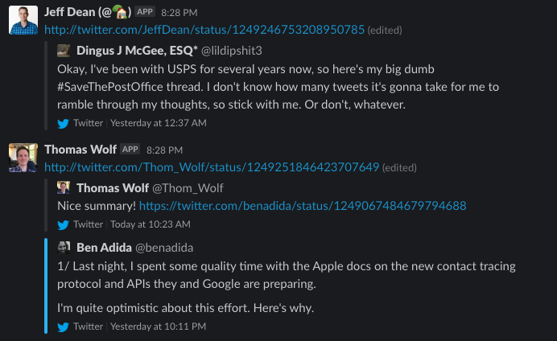

# Twitter...on Slack!
This repo provides a service which will take Twitter statuses, replies and retweets from your news feed and 
publish them to a slack channel, resulting in a stream of posts that look like this:



I can't take much credit for the functionality of this repo, it is built on top of Slack's amazing [python client](https://github.com/slackapi/python-slackclient) 
as well as [bear/python-twitter](https://github.com/bear/python-twitter).

## Quickstart
The authentication for Slack and Twitter works via env variables.  
To run `twitter-on-slack` you will need to set the following env variables:

```
TWITTER_CONSUMER_KEY
TWITTER_CONSUMER_SECRET
TWITTER_ACCESS_TOKEN
TWITTER_ACCESS_TOKEN_SECRET
SLACK_API_TOKEN
TWITTER_ON_SLACK_CHANNEL
```

Where `TWITTER_ON_SLACK_CHANNEL` is the name of the channel you'd like to publish the twitter posts.  
For more info on obtaining the Slack/Twitter tokens, see the 
[python-twitter](https://python-twitter.readthedocs.io/en/latest/getting_started.html) and 
[Slack API](https://api.slack.com/authentication/basics) docs.

After this, install the necessary requirements via `pip install -r requirements.txt`

Following successful installation, `python main.py` will start the process of pulling Twitter 
posts every minute, publishing new ones to `TWITTER_ON_SLACK_CHANNEL`

## Deployment
It is recommended to use this repository as a service.  To do so, fill the above env variables in a file named `.env` 
in the repository directory (see `.env.example` to see how this should be set up).  Then build the image with

`docker build -t twitter-on-slack .`

And deploy with

`docker-compose up -d`

## Contributing
Found a bug?  Think this repo could do with more functionality?

Please submit your feedback via the issue board and it will be seen to.  Alternatively if you feel 
like contributing, your pull requests are most welcome!
